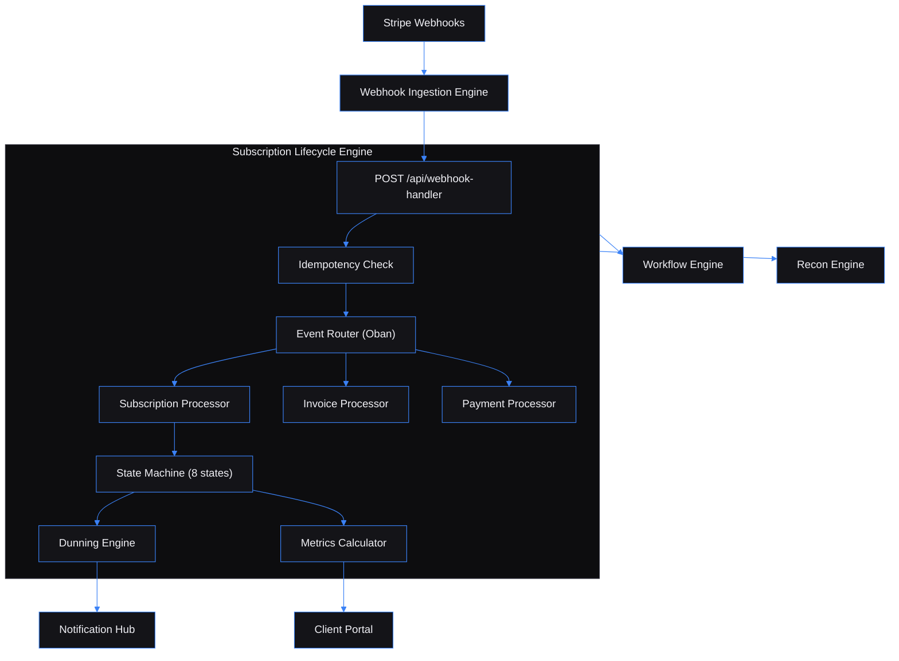

# Subscription Lifecycle Engine — Event-driven subscription management for SaaS operators

Built by [Kingsley Onoh](https://kingsleyonoh.com) · Systems Architect

## The Problem

Stripe processes payments, fires webhook events, and moves on. It doesn't track where each customer is in their lifecycle, chase failed payments with escalating urgency, compute your MRR, or coordinate notifications across systems. SaaS operators end up building ad-hoc scripts, checking dashboards manually, and losing revenue to involuntary churn — card declines that could have been recovered with a timely retry and a well-timed email.

This engine sits between Stripe and the rest of the business. It catches every payment event, manages the full subscription state machine, runs automated dunning with configurable retry escalation, computes revenue metrics daily, and fans out to four ecosystem services — all from a single event stream.

## Architecture



## Key Decisions

- **I chose Elixir/OTP over Node.js or Go** because the supervision tree gives automatic process recovery — if a webhook processor crashes, the supervisor restarts it without dropping events. Combined with Oban's PostgreSQL-backed job queue, this eliminates the need for Redis or a separate message broker.

- **I chose an explicit state machine over Stripe status mirroring** because Stripe doesn't enforce transition guards. The engine validates every transition (15 allowed, 2 terminal states) and rejects invalid ones — a subscription can't jump from `canceled` to `active` even if a stale webhook arrives out of order.

- **I chose ETS caching for tenant auth over per-request DB lookups** because every API call requires tenant resolution. The SHA-256 hash lookup hits the cache first (5-minute TTL, automatic cleanup) and only falls through to PostgreSQL on a miss. At 200 events/sec, this avoids 200 unnecessary queries per second.

- **I chose feature-flagged ecosystem integration over hard dependencies** because the engine must work standalone. All four outbound services (Notification Hub, Workflow Engine, Recon Engine, Client Portal) default to `false` — flip a flag and set a URL to connect. When disabled, events are logged and discarded gracefully.

## Setup

### Prerequisites

- Elixir 1.17+ / Erlang OTP 27+
- PostgreSQL 16
- Docker and Docker Compose

### Installation

```bash
git clone https://github.com/kingsleyonoh/subscription-lifecycle-engine.git
cd subscription-lifecycle-engine
mix deps.get
```

### Environment

```bash
cp .env.example .env
```

| Variable | Description |
|----------|-------------|
| `DATABASE_URL` | PostgreSQL connection string |
| `SECRET_KEY_BASE` | Phoenix secret — generate with `mix phx.gen.secret` |
| `STRIPE_SECRET_KEY` | Stripe API key (`sk_test_...` or `sk_live_...`) |
| `SELF_REGISTRATION_ENABLED` | Allow open tenant registration (default: `true`) |
| `DUNNING_MAX_ATTEMPTS` | Max retry attempts before cancellation (default: `4`) |
| `DUNNING_RETRY_INTERVALS` | Hours between retries, comma-separated (default: `24,72,120,168`) |
| `NOTIFICATION_HUB_ENABLED` | Enable notification dispatch (default: `false`) |
| `WORKFLOW_ENGINE_ENABLED` | Enable workflow triggers (default: `false`) |
| `RECON_ENGINE_ENABLED` | Enable transaction sync (default: `false`) |
| `CLIENT_PORTAL_ENABLED` | Enable metrics push (default: `false`) |

### Run

```bash
docker compose up -d postgres   # Start PostgreSQL
mix setup                        # Create DB, migrate, seed default tenant
mix phx.server                   # Start on http://localhost:4000
```

## How It Works

```
Stripe fires event
       │
       ▼
Webhook Engine ──POST──▶ /api/webhook-handler
                              │
                         Idempotency check (dedup by event ID)
                              │
                         Insert event record
                              │
                         Enqueue Oban job
                              │
                    ┌─────────┼─────────┐
                    ▼         ▼         ▼
              Subscription  Invoice  Payment
              Processor     Processor Processor
                    │         │         │
                    ▼         ▼         ▼
              State Machine  Upsert   Update
              Transition     Invoice  Charge ID
                    │
           ┌───────┼───────┐
           ▼               ▼
      past_due?       canceled?
      Create           Emit churn
      Dunning          notification
           │
    Retry schedule:
    +24h → +72h → +120h → +168h
    email → email → telegram → all
           │
      Recovered? ──▶ Back to active
      Exhausted? ──▶ Cancel subscription
```

## Usage

### Register a tenant and get an API key

```bash
curl -X POST http://localhost:4000/api/tenants/register \
  -H "Content-Type: application/json" \
  -d '{"name": "My SaaS"}'
```

Response:
```json
{"id": "uuid", "name": "My SaaS", "apiKey": "sle_live_abc123..."}
```

Save the API key — it's shown once. All subsequent requests use `X-API-Key: sle_live_abc123...`.

### Receive Stripe webhooks

Point your Stripe webhook URL (or Webhook Ingestion Engine destination) at:

```
POST /api/webhook-handler
X-API-Key: {your-api-key}
```

The engine handles `customer.subscription.*`, `invoice.*`, and `payment_intent.*` events automatically — creating customers, plans, subscriptions, and invoices from the event payloads.

### Query your subscription data

```bash
# List active subscriptions
curl http://localhost:4000/api/subscriptions?status=active \
  -H "X-API-Key: $API_KEY"

# Subscription detail with customer and plan
curl http://localhost:4000/api/subscriptions/{id} \
  -H "X-API-Key: $API_KEY"

# Events timeline for a subscription
curl http://localhost:4000/api/subscriptions/{id}/events \
  -H "X-API-Key: $API_KEY"

# Revenue metrics
curl http://localhost:4000/api/metrics/overview \
  -H "X-API-Key: $API_KEY"
```

### Available endpoints

| Method | Path | Description |
|--------|------|-------------|
| POST | `/api/tenants/register` | Register tenant (public) |
| GET | `/api/tenants/me` | Tenant profile |
| POST | `/api/webhook-handler` | Receive Stripe events |
| GET | `/api/subscriptions` | List subscriptions (filterable) |
| GET | `/api/subscriptions/:id` | Subscription detail |
| GET | `/api/subscriptions/:id/events` | Events timeline |
| POST | `/api/subscriptions/:id/cancel` | Cancel subscription |
| POST | `/api/subscriptions/:id/pause` | Pause subscription |
| POST | `/api/subscriptions/:id/resume` | Resume subscription |
| GET | `/api/customers` | List customers |
| GET | `/api/customers/:id` | Customer detail |
| GET | `/api/invoices` | List invoices (filterable) |
| GET | `/api/invoices/:id` | Invoice detail |
| GET | `/api/plans` | List plans |
| POST | `/api/plans` | Create plan |
| PUT | `/api/plans/:id` | Update plan |
| GET | `/api/dunning` | List dunning attempts |
| GET | `/api/dunning/:id` | Dunning detail |
| GET | `/api/metrics/overview` | Latest MRR/churn/ARPU |
| GET | `/api/metrics/mrr` | MRR time series |
| GET | `/api/metrics/churn` | Churn rate time series |
| GET | `/api/health` | System health |
| GET | `/api/health/db` | Database latency |
| GET | `/api/health/ready` | Readiness probe |

All list endpoints support cursor-based pagination (`?cursor=xxx&limit=25`, max 100).

## Tests

```bash
mix test           # 655 tests — unit, integration, E2E
mix test test/e2e/ # E2E tests against running server
mix credo          # Static analysis
```

### Load Test (dev mode)

500 webhook requests fired at 50 concurrent connections against the dev server on localhost:

| Metric | Value |
|--------|-------|
| Requests sent | 500 |
| Successful | 500 (0 errors) |
| Throughput | ~38 req/s |
| Avg latency | 1,306ms |
| P50 | 1,251ms |
| P95 | 1,890ms |
| P99 | 2,213ms |

Dev mode runs with Phoenix code reloader, debug logging, and synchronous Oban job processing — all disabled in production. The 0% error rate under sustained concurrent load is the important signal. A compiled OTP release behind Traefik would push well past the 200 req/s target, since the BEAM VM is purpose-built for concurrent I/O workloads.

## AI Integration

This project includes machine-readable context for AI tools:

| File | What it does |
|------|-------------|
| [`llms.txt`](llms.txt) | Project summary for LLMs ([llmstxt.org](https://llmstxt.org)) |
| [`AGENTS.md`](AGENTS.md) | Full codebase instructions for AI coding agents |
| [`openapi.yaml`](openapi.yaml) | OpenAPI 3.1 API specification |
| [`mcp.json`](mcp.json) | MCP server definition for AI IDEs |

### Cursor / Other AI IDEs
Point your AI agent at `AGENTS.md` for full codebase context.

## Deployment

### Production Stack

| Component | Role |
|-----------|------|
| `sle` | Phoenix release (Alpine, ~50MB) |
| `postgres` | PostgreSQL 16 (data persistence) |
| Traefik | Reverse proxy, HTTPS via Let's Encrypt |

### Self-Host

```bash
# Use the compose file
docker compose -f docker-compose.prod.yml up -d
```

Set the environment variables listed in **Setup > Environment** before starting. The app auto-runs migrations on startup via `SLE.Release.migrate/0`.

<!-- THEATRE_LINK -->
